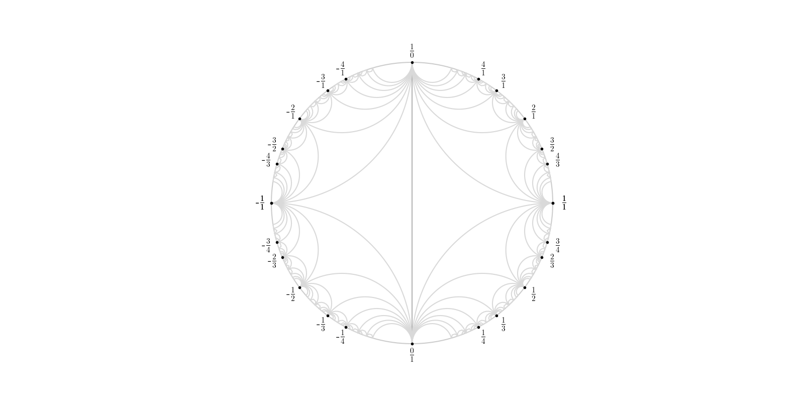

# FAREY_DIAGRAM

The Farey diagram is a geometric construction 
in the unit disc see
[this article](https://jonathanlove.info/teaching/23-NT/walsh.pdf)
or page 28 of [Hatcher's book](https://pi.math.cornell.edu/~hatcher/TN/TNpage.html)

The [code](https://github.com/macbuse/FAREY_DIAGRAM/blob/main/farey_diagram.ipynb) in this repository is licensed under the [creative commons license](https://creativecommons.org/licenses/by-sa/4.0/) you can read the details [here](https://github.com/santisoler/cc-licenses/blob/main/LICENSE).

